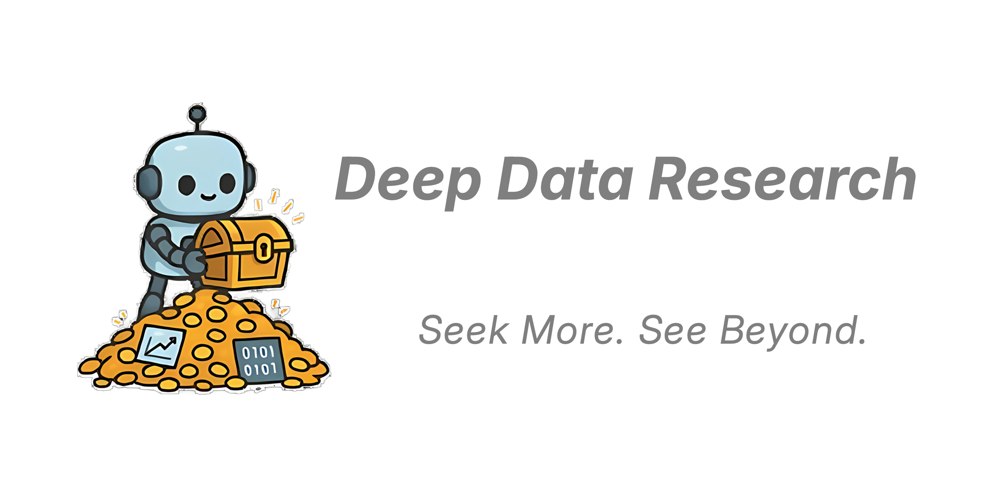
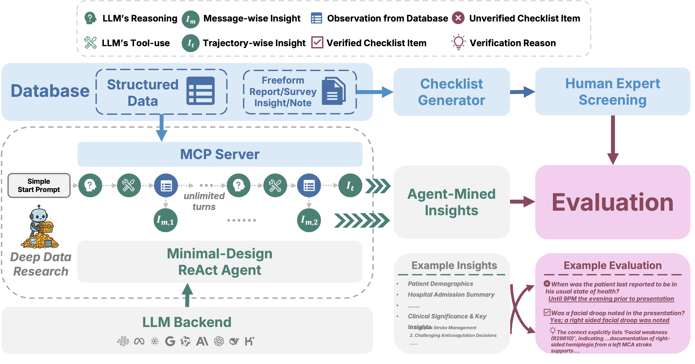

# Deep Data Research

<p align="center">
  
</p>


<p align="center">
  <strong>Hunt Instead of Wait: Evaluating Deep Data Research on Large Language Models</strong>
</p>


<p align="center">
  <a href="https://huggingface.co/spaces/thinkwee/DDR_Bench">
    
  </a>
  <a href="https://arxiv.org/abs/2602.02039">
    
  </a>
  <a href="https://www.alphaxiv.org/abs/2602.02039">
    
  </a>
  <a href="https://huggingface.co/papers/2602.02039">
    
  </a>
  <a href="https://huggingface.co/collections/thinkwee/ddrbench">
    
  </a>
</p>


We introduce **DDR-Bench** (Deep Data Research Benchmark): A benchmark for evaluating LLM agents on autonomous data exploration and analysis tasks without predefined queries or goals.

## Overview

<p align="center">
  
</p>

DDR-Bench provides a framework for running and evaluating LLM-based data analysis agents across three real-world domains:

| Scenario | Domain | Data Type | Task |
|----------|--------|-----------|------|
| **MIMIC** | Healthcare | MIMIC-IV patient records | Extract clinical insights from electronic health records |
| **10-K** | Finance | SEC 10-K filings | Analyze XBRL filings data to get company financial insights |
| **GLOBEM** | Behavioral | GLOBEM wearable data | Discover user well-beings from wearable data patterns |

## Installation

- Python 3.10+
- Required packages:

```bash
pip3 install -r requirements.txt
```

## Run the Agent

1. Modify the configuration file `config.yaml` to set up paths and LLM settings.


2. Set up API keys as environment variables:
```bash
export GEMINI_API_KEY="your-gemini-api-key"
export AZURE_OPENAI_API_KEY="your-azure-openai-key"
export AZURE_OPENAI_ENDPOINT="your-azure-endpoint"
# Or other provider keys as needed
```

3.  Run

Use `run_agent.py` to run data analysis agents. All configurations (LLM provider, model, data paths) are managed in `config.yaml`. See configuration section for more details.

```bash
python run_agent.py --scenario mimic
python run_agent.py --scenario 10k
python run_agent.py --scenario globem
```

It will create a log directory at ``base_log_dir`` from ``config.yaml``, where all the agent trajectories, run metadata and insights are stored. The log directory is then used by the evaluation script to evaluate the agent's performance.

> **Note**: Path configurations (`db_path`, `data_path`) and LLM settings (`provider`, `model`, `api_key`) should be set in `config.yaml`.

## Run the Evaluation

Use `run_evaluation.py` to evaluate agent results using LLM-as-a-checker against ``data/*/qa.json`` . Like the agent runner, evaluation paths are also pulled from `config.yaml`:

```bash
# Evaluate MIMIC results
python run_evaluation.py --scenario mimic --log-dir ./{base_log_dir}/mimic

# Evaluate 10-K results
python run_evaluation.py --scenario 10k --log-dir ./{base_log_dir}/10k

# Evaluate GLOBEM results
python run_evaluation.py --scenario globem --log-dir ./{base_log_dir}/globem
```

## Configuration

Configuration is managed via `config.yaml`. You only need to adjust the following essential settings; all other parameters (like `max_turns`, `log_level`, etc.) are pre-configured with sensible defaults.

```yaml
# 1. LLM Provider Settings
provider:
  default_provider: "gemini"    # Options: gemini, vllm, openai, minimax
  default_model: "gemini-2.0-flash"

evaluation:
  provider: "azure"             # Provider for LLM-as-judge
  model: "gpt-5-mini"

# 2. Database Paths (Set to your local database locations)
scenarios:
  mimic:
    db_path: "/path/to/mimic_iv.db" # Download from physionet.org, coming soon
  10k:
    db_path: "/path/to/10k_financial_data.db" # Download from https://huggingface.co/datasets/thinkwee/DDRBench_10K/tree/main/raw
  globem:
    data_path: "/path/to/globem_data/" # Download from physionet.org, coming soon
```

### Environment Variables

Set up your API keys as environment variables:

| Variable | Description |
|----------|-------------|
| `GEMINI_API_KEY` | Google Gemini API key |
| `AZURE_OPENAI_API_KEY` | Azure OpenAI API key |
| `AZURE_OPENAI_ENDPOINT` | Azure OpenAI endpoint URL |
| `OPENAI_API_KEY` | OpenAI API key (if not using Azure) |
| `MINIMAX_API_KEY` | MiniMax API key |

## Data
- 10 K
  - The checklist, database, and agent trajectories are fully open sourced.
  - Checklist https://github.com/thinkwee/DDR_Bench/tree/main/data
  - Database https://huggingface.co/collections/thinkwee/ddrbench
  - Agent trajectories https://huggingface.co/datasets/thinkwee/DDRBench_10K_trajectory
- MIMIC
  - Access requires certification from PhysioNet.
  - Obtain certification and download the data from MIMIC IV v3.1 at https://physionet.org/content/mimiciv/3.1/
  - Use ``scripts/construct_mimic_sqlite.py`` to convert the data into a SQLite database
  - Update ``scenarios.mimic.db_path`` in ``config.yaml`` to point to the generated SQLite database
- GLOBEM
  - Access also requires certification from PhysioNet.
  - Obtain certification and download the data from https://physionet.org/content/globem/1.1/
  - Use ``scripts/process_globem.py`` to preprocess the data
  - Update ``scenarios.globem.data_path`` in ``config.yaml`` to point to the processed data directory